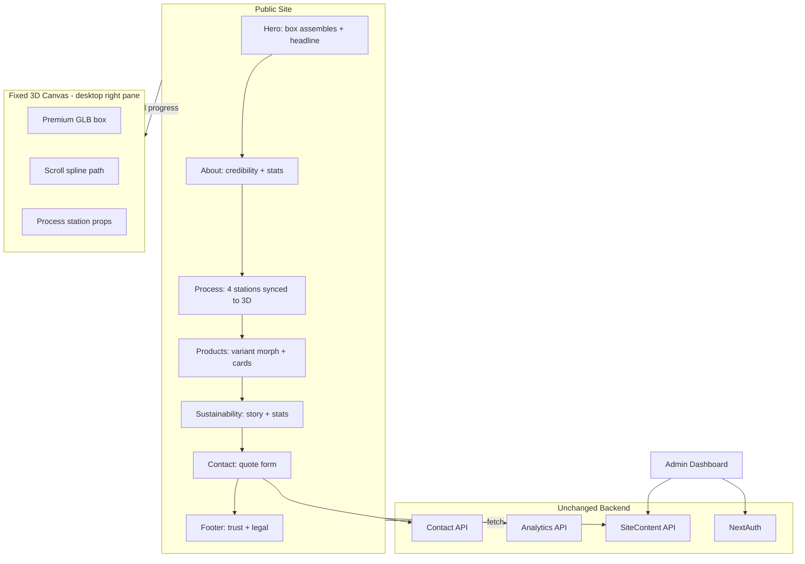
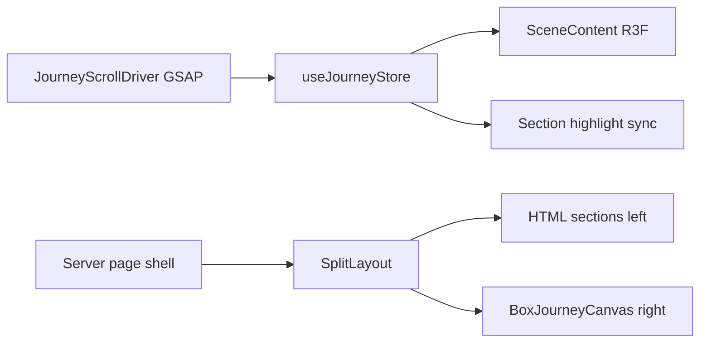
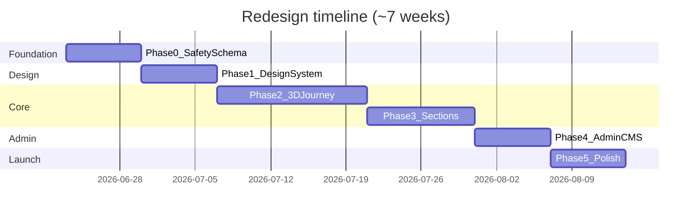

# $1M Frontend Redesign — Implementation Plan

## What stays (do not rewrite)

All server logic, data layer, and integrations remain. The redesign replaces **presentation + content wiring**, not the business backend.

| Layer | Keep as-is (with targeted fixes) |
|-------|-----------------------------------|
| **Database** | MongoDB via [`lib/db.ts`](lib/db.ts) |
| **Models** | [`Analytics`](lib/models/Analytics.ts), [`Inquiry`](lib/models/Inquiry.ts), [`SiteContent`](lib/models/SiteContent.ts) — **schema extended**, not replaced |
| **API routes** | All 11 routes under [`app/api/`](app/api/) — add auth middleware in Phase 0 |
| **Auth** | NextAuth Google OAuth in [`app/api/auth/[...nextauth]/route.ts`](app/api/auth/[...nextauth]/route.ts), [`middleware.ts`](middleware.ts) |
| **Analytics pipeline** | POST/GET [`app/api/analytics/route.ts`](app/api/analytics/route.ts), export/cleanup routes |
| **Contact** | [`app/api/contact/route.ts`](app/api/contact/route.ts) → `Inquiry` model |
| **Admin capabilities** | Messages CRUD, site publish, heatmap, analytics widgets (re-skinned) |

**Delete / retire (dead code only):** [`lib/auth.ts`](lib/auth.ts), [`app/(marketing)/page.tsx`](app/(marketing)/page.tsx), [`lib/site-data.ts`](lib/site-data.ts), empty [`store/useStore.ts`](store/useStore.ts), unused [`components/AnalyticsTracker.tsx`](components/AnalyticsTracker.tsx).

---

## Target experience ($1M bar)



**Art direction (no assets yet):**
- Palette: deep charcoal `#0c0a09`, warm kraft `#c4a574`, single accent red `#991b1b`, eco green only in sustainability
- Typography: **display** (e.g. Instrument Serif or Syne) + **body** (Plus Jakarta Sans) — replace generic Inter
- Layout: **editorial left column** (~42rem max) + **immersive 3D right pane** (~50vw), never full-width opaque sections over canvas
- Motion: GSAP scroll scrub for 3D; Framer for UI only; respect `prefers-reduced-motion`
- Placeholders: branded gradient meshes + labeled CMS image slots (`heroImage`, `aboutImage`, `productImages[]`) until real shoot

---

## Phase 0 — Foundation and safety (Week 1)

**Goal:** Stable base before any visual rewrite.

1. **Protect admin APIs** — Add shared `requireAdminSession()` helper; gate all [`app/api/admin/*`](app/api/admin/) routes (currently public — critical security gap).
2. **Unify analytics** — Remove duplicate tracking in [`app/page.tsx`](app/page.tsx) vs [`AnalyticsProvider`](components/providers/AnalyticsProvider.tsx); single client tracker with correct payload shape (`section_engagement`, duration in seconds).
3. **Unify content schema** — Extend [`SiteContent`](lib/models/SiteContent.ts) to match UI (see schema below); migration via updated [`seed`](app/api/admin/seed/route.ts).
4. **Add `.env.example`** — Document `MONGODB_URI`, `NEXTAUTH_*`, `GOOGLE_*`, `ADMIN_EMAIL`.
5. **Remove dead routes/files** — Delete [`app/(marketing)/page.tsx`](app/(marketing)/page.tsx) duplicate.

### Canonical `SiteContent` shape (single source of truth)

```typescript
{
  hero: { title, subtitle, ctaPrimary, ctaSecondary, imageUrl? },
  about: { title, description, stats: [{ value, label }] },
  process: { title, steps: [{ title, description, icon? }] },
  products: { title, items: [{ slug, name, strength, flute, use, imageUrl, ply: "3"|"5"|"7"|"diecut" }] },
  sustainability: { title, description, stats: [{ stat, label }] },
  contact: { title, description, phone, email, address, mapUrl? },
  company: { name, tagline, logoUrl?, certifications: [{ name, imageUrl? }] }
}
```

Add shared types in new [`lib/content-types.ts`](lib/content-types.ts) consumed by sections, admin, and API.

---

## Phase 1 — Design system and app shell (Week 2)

**Goal:** New visual language before rebuilding sections.

### New folder structure (frontend)

```
components/
  design-system/     # Button, Eyebrow, Heading, StatCard, GlassPanel, Container
  layout/            # SiteHeader, SiteFooter, MarketingLayout, SplitLayout
  experience/        # 3D (rebuilt cleanly)
  sections/          # All marketing sections (rewritten)
  admin/             # Re-skinned widgets
app/
  page.tsx           # Server Component shell + client journey island
  products/          # Unified with CMS
  layout.tsx         # Fonts, metadata, providers
styles/
  tokens.css         # Brand tokens (@theme)
```

### Design system deliverables

| Token / primitive | Purpose |
|-------------------|---------|
| `@theme` colors, radii, shadows | Replace ad-hoc Tailwind in every file |
| `Container`, `Section`, `Eyebrow`, `DisplayHeading` | Consistent editorial rhythm |
| `GlassPanel` | Left-column content cards that float over 3D without blocking right pane |
| `Button` variants | primary / ghost / outline — one CTA style sitewide |
| Font loading in [`app/layout.tsx`](app/layout.tsx) | Display + body; remove dead Geist CSS vars |

### App shell

- **`SiteHeader`** — refined navbar, active section indicator, theme toggle (wire existing [`ThemeContext`](lib/ThemeContext.tsx)), scroll-to-section
- **`SiteFooter`** — company info, contact, certifications placeholders, privacy/terms stubs
- **`SplitLayout`** — enforces left content / right 3D gutter on `md+`; fixes root cause of “box not visible”

---

## Phase 2 — Rebuild 3D journey (Weeks 3–4)

**Goal:** Premium scroll story, rebuilt on clean architecture (not patching current [`components/experience/*`](components/experience/)).

### Architecture (clean rewrite)



| Component | Responsibility |
|-----------|----------------|
| [`store/useJourneyStore.ts`](store/useJourneyStore.ts) | Keep concept; simplify API; DOM-based section progress |
| `JourneyScrollDriver` | Single ScrollTrigger master timeline |
| `BoxJourneyCanvas` | Dynamic import, `ssr: false`, explicit `width/height 100%` |
| `SceneContent` | Camera rig, lighting, fog, section modes |
| `BoxModel` | Start with enhanced procedural box; **slot for `.glb`** at `public/models/box.glb` |
| `ProcessStations3D` | Premium low-poly stations with labeled CMS-driven step names |
| `MobileJourneyFallback` | Full-width static hero illustration + step progress (not tiny corner widget) |

### Journey beats (unchanged narrative, better execution)

1. **Hero** — flat kraft sheet → folded box; headline in left column
2. **About** — box scales in factory context; stats as glass cards
3. **Process** — box stops at 4 stations; timeline + 3D sync (fix tall scroll sections without arbitrary `320vh` hacks — use ScrollTrigger pin per station)
4. **Products** — box morphs by `ply` field from CMS; card hover locks variant
5. **Sustainability** — green grade + particle fibers; stats from CMS
6. **Contact** — box lands; form in glass panel; keep Lottie success from [`Contact.tsx`](components/sections/Contact.tsx)

### Performance rules

- Code-split Three.js bundle (only on `/`)
- Desktop-only WebGL; mobile gets designed 2D fallback
- Target LCP: content paints first, 3D lazy-inits after `requestIdleCallback`
- Draco-compressed GLB when custom model is added

---

## Phase 3 — Rebuild all marketing sections (Weeks 4–5)

**Goal:** Replace every file in [`components/sections/`](components/sections/) with design-system-based components.

| Section | CMS fields | Premium additions |
|---------|------------|-------------------|
| **Hero** | `hero.*` | Eyebrow from `company.name`, image slot, scroll hint |
| **About** | `about.*` | Split stat grid, optional image slot |
| **Process** | `process.title`, `process.steps[]` | Pinned scroll timeline, active step glow, 3D sync |
| **Products** | `products.*` | 4-up cards, hover → 3D variant, link to `/products/[slug]` |
| **Sustainability** | `sustainability.*` | Full-bleed green panel **left column only** |
| **Contact** | `contact.*` | Zod validation UI, better error states, keep API contract |

### Pages

- **[`app/page.tsx`](app/page.tsx)** — Refactor to Server Component: fetch CMS server-side (`get-site` logic extracted to [`lib/get-site-content.ts`](lib/get-site-content.ts)), pass props to client journey wrapper. Remove `localStorage` CMS cache.
- **[`app/products/page.tsx`](app/products/page.tsx)** — Rebuild with shared `ProductRange` + navbar/footer; optional `[slug]` detail pages fed by CMS.
- **Metadata** — Per-page OG tags, JSON-LD `Organization` + `LocalBusiness`, `sitemap.xml`, `robots.txt`.

### Placeholder asset strategy (no shoot yet)

- CMS fields: `imageUrl` per section/product with **visible labeled placeholders** (“Upload factory photo”)
- Use high-quality abstract industrial gradients + subtle grain (not Unsplash boxes)
- Admin: image URL inputs now; Phase 5 adds upload (Cloudinary/Vercel Blob)

---

## Phase 4 — Rebuild admin dashboard UI (Week 6)

**Goal:** Complete CMS + match premium brand (admin is part of the $1M package).

Reskin [`app/admin/dashboard/page.tsx`](app/admin/dashboard/page.tsx) with design-system tokens; **implement missing editors**:

| Tab | Editor fields |
|-----|---------------|
| **Hero** | title, subtitle, CTAs, hero image URL |
| **About** | title, description, stats CRUD |
| **Process** | title, steps CRUD (reorder) |
| **Products** | title, items CRUD with ply selector + image URL |
| **Sustainability** | title, description, stats CRUD |
| **Contact** | title, description, phone, email, address |
| **Company** | name, tagline, logo URL, certifications |
| **Messages** | existing inbox (keep SWR) |
| **Analytics** | heatmap + **real** metrics (remove fake +12% trends in [`AnalyticsWidget`](components/admin/AnalyticsWidget.tsx)); wire `recharts` to `?range=` API; add Export CSV + Cleanup buttons |

Single **Publish** action → `POST /api/admin/update-site` with full typed payload.

---

## Phase 5 — Production polish (Week 7)

1. **Email on inquiry** — Resend/SendGrid notification on [`contact`](app/api/contact/route.ts) POST (env: `RESEND_API_KEY`, `SALES_EMAIL`).
2. **Contact hardening** — Rate limit, honeypot, Zod server validation.
3. **SEO** — OG image generation (static box render or branded template).
4. **Accessibility** — WCAG pass: focus rings, skip link, reduced-motion fallbacks for GSAP + Framer.
5. **CI** — GitHub Action: `lint`, `tsc`, `build`.
6. **README** — Setup, env vars, admin guide, asset checklist for future photo shoot.

---

## File migration map (old → new)

| Current | Action |
|---------|--------|
| [`components/sections/*`](components/sections/) | Rewrite using `design-system/` |
| [`components/experience/*`](components/experience/) | Rewrite in place (same folder, clean files) |
| [`components/ui/resizable-navbar.tsx`](components/ui/resizable-navbar.tsx) | Replace with `layout/SiteHeader.tsx` |
| [`app/globals.css`](app/globals.css) | Replace with `styles/tokens.css` + minimal globals |
| [`app/page.tsx`](app/page.tsx) | Server fetch + client `HomeExperience` island |
| Admin dashboard | Reskin + complete tabs |

---

## Success criteria (definition of done)

- [ ] Public site feels editorial + immersive; 3D box visible and scroll-synced on desktop
- [ ] Every visible section editable from admin (no hardcoded copy except fallbacks)
- [ ] CMS schema matches UI — admin edits appear on site after Publish
- [ ] All `/api/admin/*` routes require authenticated admin session
- [ ] Single analytics pipeline; heatmap data accurate
- [ ] Mobile experience intentional (not broken WebGL)
- [ ] Footer, metadata, sitemap present
- [ ] `npm run build` passes; Lighthouse Performance ≥ 85 mobile / ≥ 90 desktop
- [ ] Clear CMS image slots ready for real assets when shoot happens

---

## Recommended execution order



**First milestone to review:** End of Phase 1 + Phase 2 — split layout + working 3D journey with placeholder box on desktop (the “wow” demo).

---

## Asset checklist (for when you have photos)

Plan CMS slots now; fill later:

- Logo SVG, favicon
- Hero: factory exterior or corrugation line (16:9)
- About: team/facility (4:3)
- Products: 3-ply, 5-ply, 7-ply, die-cut on white (1:1 each)
- Certifications: ISO/FSC logos
- Contact: map pin / location photo

No assets required to start — placeholders are first-class in the CMS schema.
